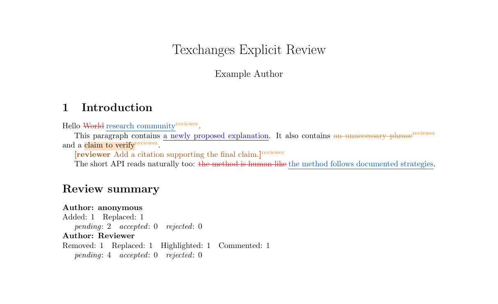
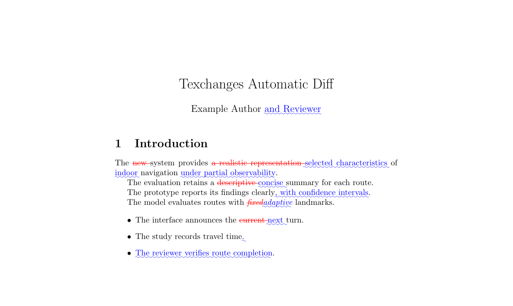

# texchanges

[](https://github.com/phucnht/texchanges/actions/workflows/ci.yml)
[](https://ctan.org/pkg/texchanges)
[](LICENSE)
[](https://phucnht.github.io/texchanges/)

`texchanges` is a LaTeX-native track-changes protocol for Overleaf, human reviewers, and AI agents. It keeps changes in plain text, renders Word-like review markup, and resolves the same source into accepted or original output.

Compared to the `changes` package, texchanges adds review decisions (`pending`/`accepted`/`rejected`), three document modes from one source, filterable change reports, and a merge CLI that resolves the markup back into clean LaTeX — plus an opt-in `changes` compatibility layer for migration. Compared to raw `latexdiff`, the markup is part of the source, so decisions survive revisions; a bundled `latexmkrc` still gives you automatic word-level diffs when you want them.

| Explicit review | Automatic `latexdiff` |
|---|---|
| [](examples/explicit-review/README.md) | [](examples/automatic-diff/README.md) |
| Keep authors, IDs, decisions, comments, and reports in one source file. [Open the example](examples/explicit-review/README.md) or [view the walkthrough](https://phucnht.github.io/texchanges/getting-started/examples/). | Compare two complete revisions with word-level `latexdiff`. [Open the example](examples/automatic-diff/README.md) or [view the walkthrough](https://phucnht.github.io/texchanges/getting-started/examples/). |

## Installation

Texchanges is on [CTAN](https://ctan.org/pkg/texchanges) and distributed through TeX Live:

```bash
tlmgr install texchanges
```

Then load it normally:

```latex
\usepackage[review]{texchanges}
```

For Overleaf projects whose TeX Live version does not include Texchanges, upload `texchanges.sty` beside the main document. The unified `texchanges-overleaf.zip` bundle (attached to every [GitHub release](https://github.com/phucnht/texchanges/releases)) includes the package, an explicit review document, automatic comparison files, and `latexmkrc`. Overleaf updates TeX Live on its own release schedule, so a new CTAN package may take time to appear there.

## Quick start

```latex
\usepackage[review]{texchanges}

\txreplace{old text}{new text}
\txadd{new text}
\txremove{old text}
```

Switch `review` to `final` to accept pending changes or to `original` to show the unchanged document.

## Structured review

```latex
\txdefineauthor[name={Phuc Nguyen},color=orange]{phuc}

\txreplace[
  author=phuc,
  id=R12,
  comment={Clarify this claim.},
  status=pending
]{human-like behavior}{O\&M-aligned behavior}
```

Change keys are:

- `author`, a registered author ID.
- `id`, an optional document-unique change ID.
- `comment`, an attached reviewer note.
- `status`, one of `pending`, `accepted`, or `rejected`.

The legacy form `\txreplace[Reviewer]{old}{new}` remains supported as a visual label. Short aliases `\add`, `\remove`, `\replace`, `\highlight`, and `\comment` are installed only when another package has not defined them.

## Modes and decisions

| Mode | Pending | Accepted | Rejected |
|---|---|---|---|
| `review` | visual old and new | proposed text | original text |
| `final` | proposed text with warning | proposed text | original text |
| `original` | original text | original text | original text |

## Reports

```latex
\txlistofchanges
\txlistofchanges[style=summary]
\txlistofchanges[
  style=list,
  title={Open reviewer changes},
  show={added,replaced,commented},
  status={pending},
  author={phuc}
]
```

Detailed reports need two LaTeX runs. With `hyperref`, entries link to changes that have an ID. Summary and compact-summary reports group counts by author and change type. Reports are displayed and recorded only in `review` mode. Report titles, change types, and statuses are localized through babel for English, British, German, French, Italian, and Vietnamese.

## Visual customization

Presets are `texchanges`, `default`, `underlined`, `bfit`, and `nocolor`.

```latex
\usepackage[
  review,
  markup=texchanges,
  addedmarkup=uline,
  deletedmarkup=sout,
  highlightmarkup=background,
  commentmarkup=inline,
  authormarkup=superscript,
  authormarkupposition=right,
  authormarkuptext=id
]{texchanges}
```

- Added/deleted styles: `colored`, `sout`, `xout`, `uline`, `uuline`, `uwave`, `dashuline`, `dotuline`, `bf`, `it`, `sl`, and `em` where relevant.
- Highlight styles: `background`, `uuline`, and `uwave`.
- Comment styles: `inline`, `todo`, `margin`, `footnote`, and `uwave`.
- Author styles: `superscript`, `subscript`, `brackets`, `footnote`, and `none`.

Additions, removals, and highlights render in the author's registered color. Replacements deliberately use the fixed removed/added palette so the old and new text stay distinguishable within one change; the author label still carries the author's color.

Runtime hooks such as `\txsetaddedmarkup`, `\txsetcommentmarkup`, `\txsetauthormarkup`, and the width/auxiliary-file setters are documented in the [online API reference](https://phucnht.github.io/texchanges/reference/api/).

## `changes` compatibility

Compatibility is opt-in because replacement arguments use the opposite order:

```latex
\usepackage[review,compat=changes]{texchanges}

\definechangesauthor[name={Phuc Nguyen},color=orange]{phuc}
\replaced[id=phuc,changeid=R12]{new text}{old text}
```

Use `commandnameprefix=none|ifneeded|always` for compatibility commands. Native `\txreplace` always remains `old` then `new`.

## Resolve source markup

The `texchanges-merge` CLI can update statuses or permanently merge markup from any working directory after it is installed by TeX Live:

```bash
texchanges-merge paper.tex reviewed.tex --accept
texchanges-merge paper.tex final.tex --accept --merge
texchanges-merge paper.tex --reject --id R12 --in-place
texchanges-merge paper.tex --accept --author phuc --dry-run
```

From a source checkout, use `python3 scripts/texchanges-merge.py` in place of `texchanges-merge`. The tool requires Python 3.10 or later and uses only the standard library.

In-place updates create a `.bak` file. Interactive mode, nested braces, Unicode, comments, and common verbatim-like environments are supported. Malformed input fails before any file is written.

## Automatic `latexdiff`

`examples/automatic-diff/` compares `texchanges-original.tex` and `texchanges-revised.tex` through Overleaf's `latexmkrc` mechanism, with `texchanges-review.tex` as the Main document. It uses word-level matching, so short shared phrases remain unchanged. The same `latexmkrc` compiles `texchanges-explicit-review.tex` normally when that document is selected as Main.

Run `make dist` to build the single `dist/texchanges-overleaf.zip` upload bundle. Its [workflow guide](examples/overleaf-workflow/README.md) explains both Main-document choices.

## Roadmap

The path to 1.0.0 is tracked as a public checklist on the website: [roadmap](https://phucnht.github.io/texchanges/roadmap/).

## Development

```bash
make check    # full verification suite (TEST=<name> filters cases)
make example
make doc
make dist
make ctan
make website
make release-check
```

The suite covers all modes, metadata, reports, styles, compatibility syntax, the CLI, pdfLaTeX, XeLaTeX, LuaLaTeX, and automatic `latexdiff`. See [tests/README.md](tests/README.md) for how to run and add tests.

## Contributing

Bug reports and pull requests are welcome — see [CONTRIBUTING.md](CONTRIBUTING.md) for how to land a change, the compatibility rules, and what reviewers look for. Report issues at <https://github.com/phucnht/texchanges/issues>.

## Limitations

- Complex display math, floats, headings, verbatim content, and some commands should be changed at a larger text boundary or reviewed with `latexdiff`.
- The merge CLI intentionally skips comments and common verbatim-like environments. Custom verbatim environments require manual review.

Maintained by Phuc Nguyen. Released under LPPL 1.3c or later. See `LICENSE`.
