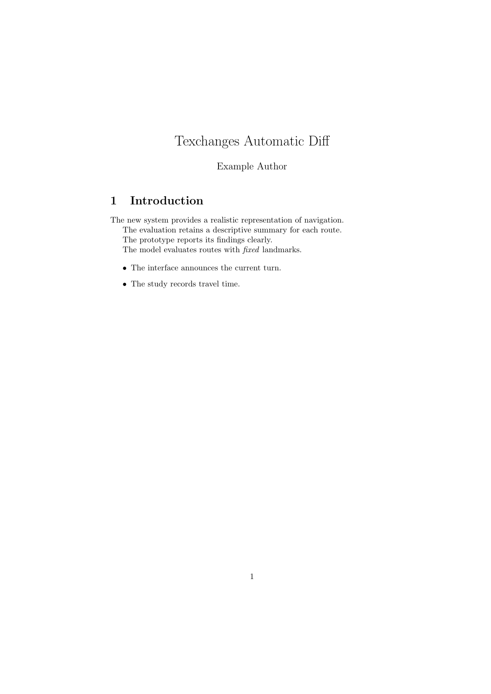
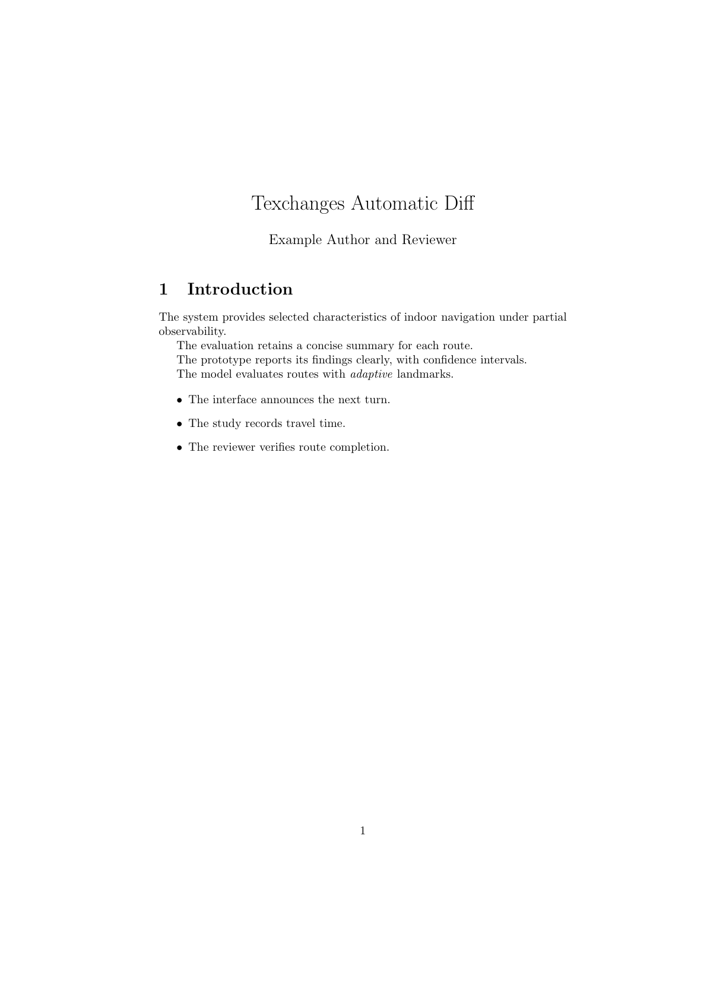
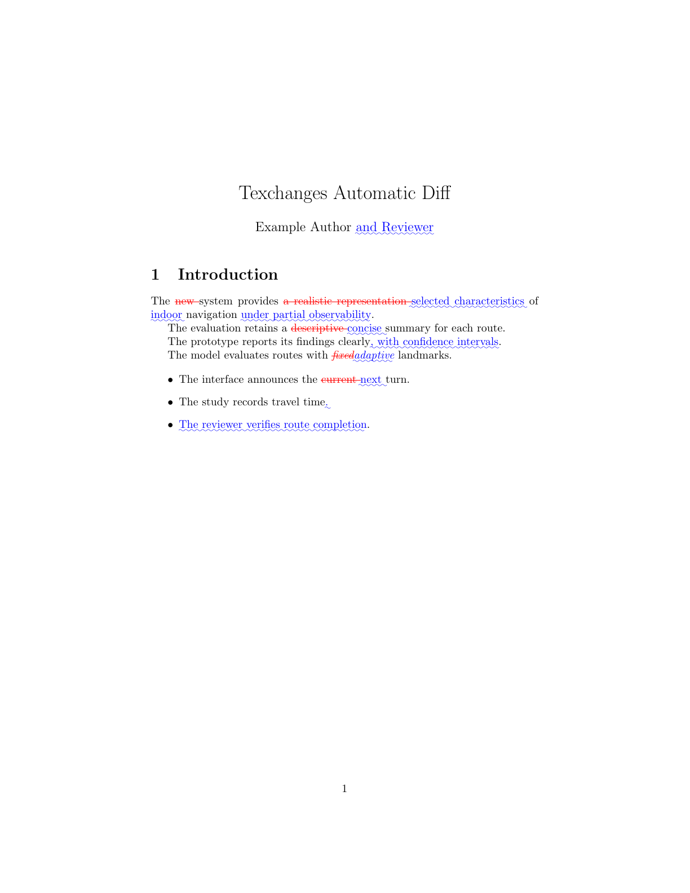

# Automatic latexdiff on Overleaf

This example compares two complete LaTeX revisions and generates a visual PDF diff automatically. It uses word-level matching, so a short shared phrase such as `system provides` remains unchanged while `new` is shown as a deletion.

## Files

- [`texchanges-original.tex`](texchanges-original.tex), the earlier revision.
- [`texchanges-revised.tex`](texchanges-revised.tex), the later revision.
- [`texchanges-review.tex`](texchanges-review.tex), select this as the Overleaf Main document.
- [`latexmkrc`](latexmkrc), runs `latexdiff` before pdfLaTeX compiles the generated review document.

## Try it on Overleaf

1. Upload all four files to a blank Overleaf project.
2. Select `texchanges-review.tex` as the Main document.
3. Compile with pdfLaTeX.
4. Recompile after changing either revision to generate a fresh visual diff.

Edit the two filenames in `latexmkrc` to match a real project. Keep filenames free of shell metacharacters because they are part of a compile command.

The example covers a removed word, a replacement with shared context, a phrase insertion, an emphasized-word replacement, and a revised list. Keep changed math, complex floats, and custom verbatim-like environments outside an automatic diff example. Use explicit Texchanges markup or manual review for those cases.

To compile either revision without diffing, select it as the Main document. The conditional `latexmkrc` runs `latexdiff` only for `texchanges-review.tex`.

## Visual walkthrough

### Earlier revision

### Later revision

### Generated visual diff

This workflow follows Overleaf's documented method:

https://www.overleaf.com/learn/latex/Articles/How_to_use_latexdiff_on_Overleaf
