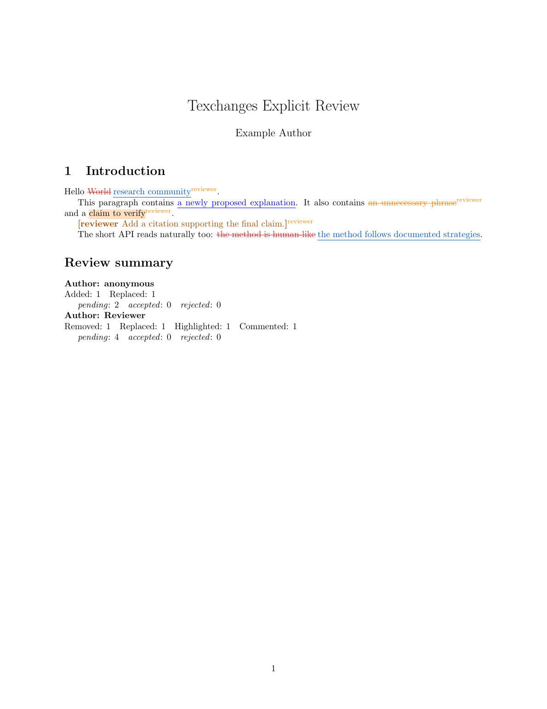
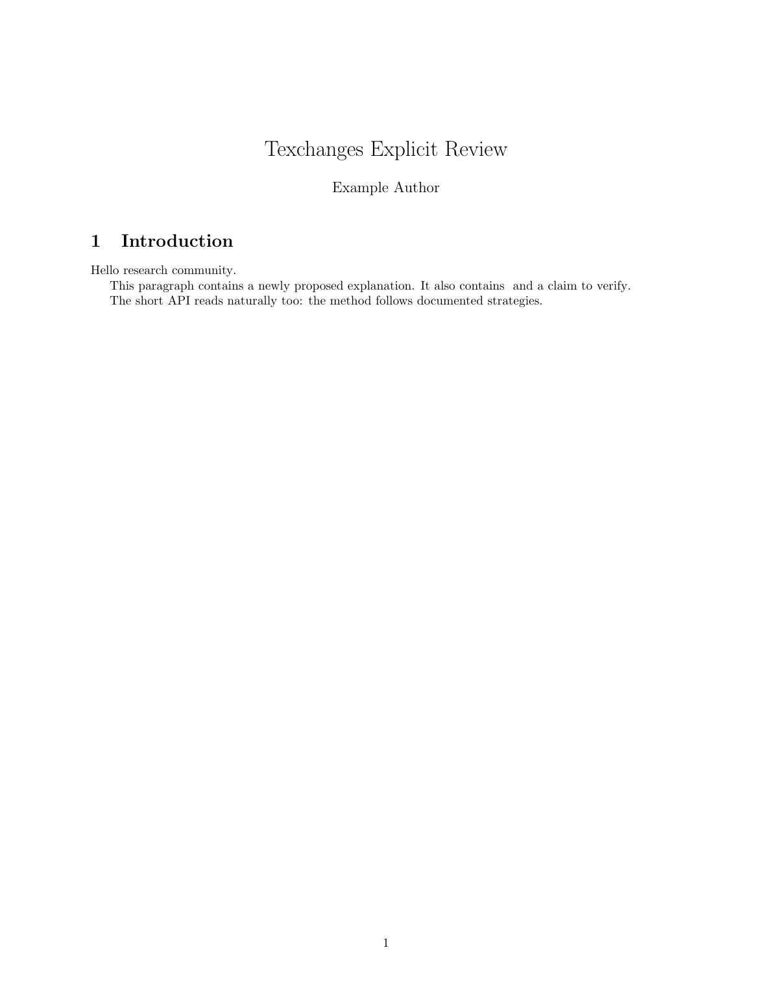
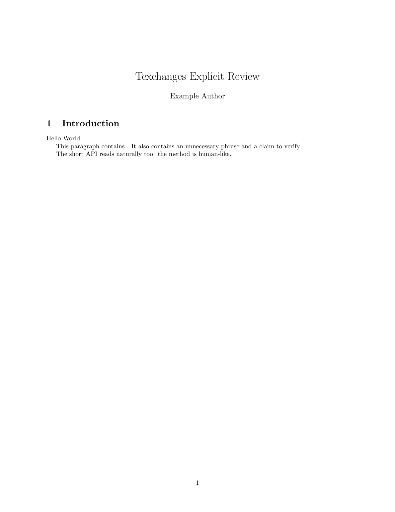

# Explicit review example

This example keeps review decisions in the LaTeX source. It demonstrates a replacement, addition, removal, highlight, comment, author labels, stable IDs, and a compact change report.

## Files

- [`texchanges-explicit-review.tex`](texchanges-explicit-review.tex), the main document.
- `texchanges.sty`, upload this beside the main document when the selected Overleaf TeX Live version does not include Texchanges.

## Try it on Overleaf

1. Create a blank project and upload the two files above.
2. Set `texchanges-explicit-review.tex` as the Main document.
3. Compile with pdfLaTeX.
4. Change `\texchangesexamplemode` to `review`, `final`, or `original`.

The same source produces three useful document states:

| Mode | What it shows |
|---|---|
| `review` | Pending markup, author labels, comments, and the change report. |
| `final` | Proposed text, with pending changes accepted for reading. |
| `original` | The document before the marked changes. |

## Visual walkthrough

### Review



### Final



### Original



## Source pattern

```latex
\txreplace[author=reviewer,id=R1]{World}{research community}
\txadd{a newly proposed explanation}
\txremove[author=reviewer,id=R2]{an unnecessary phrase}
\txcomment[author=reviewer,id=R4]{Add a citation supporting the final claim.}
```
